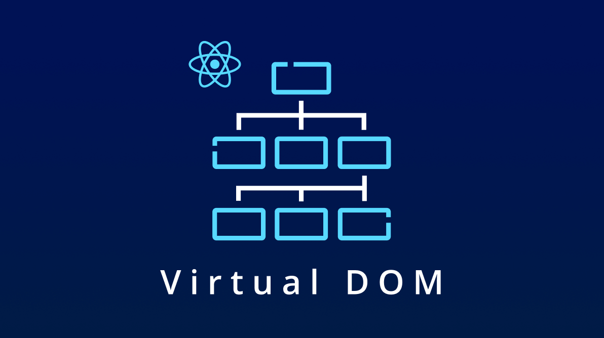
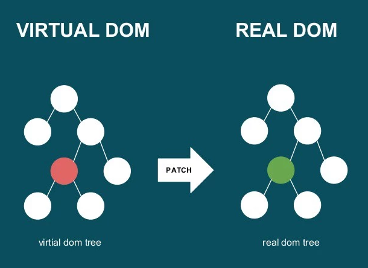

Virtual DOM və Real DOM: React-da Necə İşləyir?

Frontend inkişafında effektiv və sürətli performans təmin etmək məqsədilə müxtəlif texnologiyalar və yanaşmalar ortaya çıxıb. Bunların arasında React kitabxanası çox populyardır. React-in əsas üstünlüklərindən biri, Virtual DOM (VDOM) adlanan texnologiyadan istifadə etməsidir. Bu blog yazısında, Virtual DOM və Real DOM-un nə olduğunu və onların necə işlədiyini araşdıracağıq.

Real DOM Nədir?

DOM (Document Object Model), veb səhifənin strukturunu və məzmununu təmsil edən obyekt modelidir. HTML sənədi DOM ağacı şəklində təmsil olunur, hər element bir node (düyün) kimi təsvir edilir. Real DOM, brauzer tərəfindən işlənən və istifadəçilərə təqdim olunan faktiki DOM-dur.

Real DOM ilə işləmək bir neçə problemlərə səbəb ola bilər:

Performans Problemi: Real DOM-un manipulyasiyası vaxt aparan prosesdir. Hər hansı bir dəyişiklik ediləndə, brauzer dəyişiklikləri tətbiq etmək üçün bütün DOM-u yenidən render etməlidir. Bu, xüsusilə böyük və mürəkkəb tətbiqlərdə performans problemlərinə səbəb ola bilər.
İzləmə Problemi: DOM-da dəyişiklikləri izləmək və sinxronizasiya etmək çətindir. Bu da kodun daha kompleks və səhvli olmasına səbəb olur.
Virtual DOM Nədir?
Virtual DOM, React tərəfindən təqdim edilən və Real DOM-un effektivliyini artırmaq üçün istifadə olunan bir texnologiyadır. VDOM, Real DOM-un yüngül bir surətidir və yaddaşda saxlanılır. VDOM ilə işləməyin əsas məqsədi, Real DOM ilə müqayisədə daha sürətli və effektiv manipulyasiya təmin etməkdir.

Virtual DOM Necə İşləyir?

Render: Komponentin vəziyyəti (state) dəyişdikdə, React əvvəlcə Virtual DOM-da dəyişiklikləri tətbiq edir.
Diffing Algoritması: React, əvvəlki VDOM ilə yenilənmiş VDOM-u müqayisə etmək üçün diffing adlanan bir alqoritmdən istifadə edir. Bu alqoritm, hansı düyünlərin dəyişdiyini müəyyən edir.
Patch: Diffing alqoritminin nəticəsində, yalnız dəyişən düyünlər Real DOM-a tətbiq edilir. Bu proses patch adlanır və Real DOM-un bütününü yenidən render etmək əvəzinə, yalnız lazımi dəyişiklikləri edir.
Virtual DOM-un Üstünlükləri
Sürət: VDOM, Real DOM ilə müqayisədə daha sürətli işləyir, çünki dəyişikliklər yaddaşda həyata keçirilir və yalnız son nəticə Real DOM-a tətbiq edilir.
Effektivlik: Yalnız lazım olan dəyişikliklər Real DOM-a tətbiq edilir, bu da tətbiqin ümumi performansını artırır.
Asan İzləmə: React komponentlərinin vəziyyətinə əsasən dəyişiklikləri izləmək daha asandır və kodun daha oxunaqlı olmasını təmin edir.

